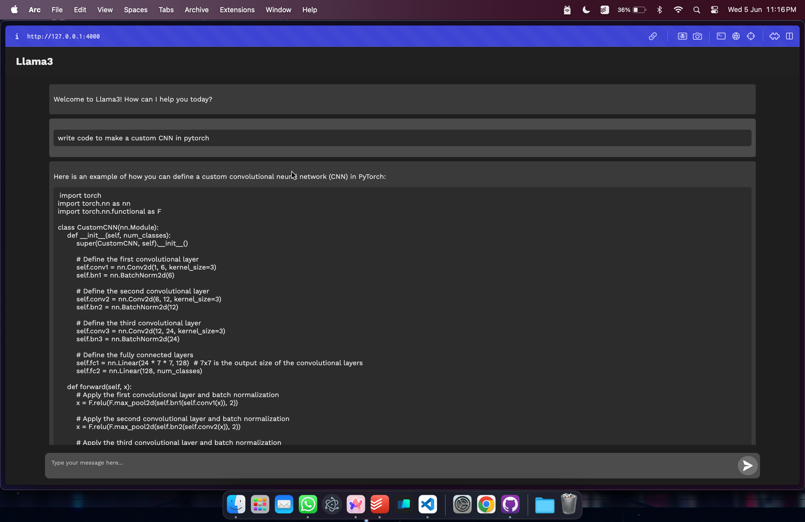

### User Interface for Ollama Llama3

#### Usage

1. Install Flask ```pip install Flask```

2. Install Flask CORS ```pip install flask-cors```

3. Install ollama from <a href='ollama.com'>here</a>

2. Install Llama3 in the terminal ```ollama pull llama3```

4. Install the ollama library ``` pip install ollama ```

5. Clone this repository. Go in the root directory and run ```python app.py```

<p style="color:red">Note: you will need python installed along with the flask library</p>

